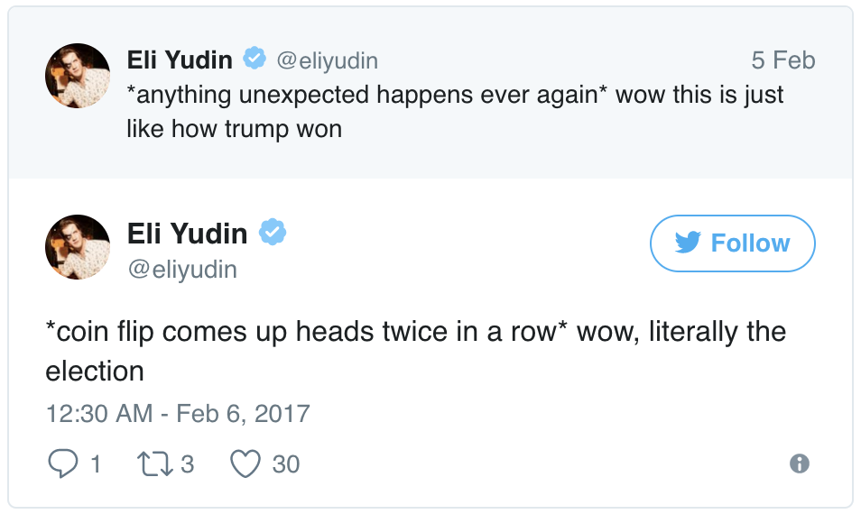
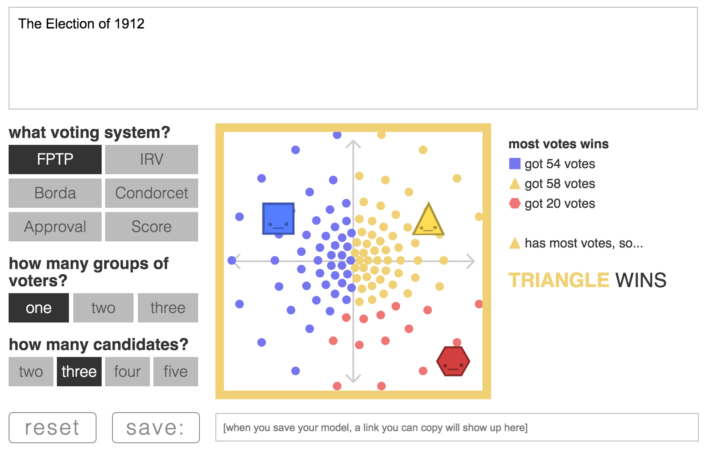

<!--
When we think about statistical graphics we most often think about graphs that
visualize one, two, or three dimensions like a box plot or a scatter plot. Those
kinds of graphs help us visualize trends, model fits, and residuals which are
all valuable insights for statisticians. Lately I've become interested in
visualizations beyond the traditional X-Y plane, which I hope can allows us to
communicate new kinds of insights interactively.
-->

```{r setup, include=FALSE}
options(htmltools.dir.version = FALSE)
```

background-image: url(https://www.gatesnotes.com/-/media/Images/Articles/About-Bill-Gates/Remembering-Hans-Rosling/hans-rosling-memoriam_2017_article_1200x564_v1.jpg)

<!--
In the past year the public health community has lost a few of its legends
including Hans Rosling, the founder of [Gapminder](https://www.gapminder.org/).
Gapminder does incredible work promoting data about human development and 
enabling the public to have a better understanding of global public health
problems.
-->

---


[The Best Stats You've Ever Seen](https://www.ted.com/talks/hans_rosling_shows_the_best_stats_you_ve_ever_seen)

<!--
In general I'm not a fan of Ted talks, but Hans Rosling's talk
[*The Best Stats You've Ever Seen*](https://www.ted.com/talks/hans_rosling_shows_the_best_stats_you_ve_ever_seen) is must-see because of his signature
presentation style and his use of interactive graphics. When he gave this talk
in 2006 there were virtually no off-the-shelf interactive graphics packages so
Gapminder built their own, which Dr. Rosling uses during his talk to the
amazement of the audience.

I've been thinking about this talk and about how it conveys intuition in
three dimensions.  Seeing countries rise and fall along human development 
parameters across time allows the audience to think of each country as an
independent agent in a system. As the system evolves Dr. Rosling walks the
audience through how policy changes that were made in each country effect
their movement in the system and the resulting societal improvements.
-->

---
class: center, middle

# Most People Struggle to Understand Models

<!--
As statisticians we're often interested in studying systems - so we create
models that approximate the parameters of a system based on individual
outcomes. However conveying what it is that our models are trying to say is
often difficult. When I look at a table of coefficients from a linear model it
often takes me a few minutes to understand the relationships between terms and
their interactions.
-->

---


<!--
I'm sure you can relate to my experience during the recent Presidential 
election when some of my friends asked me my opinion about certain electoral
prediction models. This graphic shows the outcome of thousands of simulations
run under FiveThirtyEight's model a few days before the election. 
I tried to explain what it means for a model to give a
candidate a ~25% chance of winning, but I still felt that the intuition behind these
predictive models wasn't being conveyed by their creators. After the election
there was considerable outrage by the public which is summed up pretty well by
the following tweet.
-->

---



<!--
Anybody who flipped a coin twice would not consider the occurence of two heads
in a row to be a miracle, and yet there is a widespread belief that groups
like FiveThrityEight who took into account a fair amount of uncertainty in their model
"got the election wrong."
-->

---
class: center, middle

# Interactive Model Explanations that I Admire

<!--
Now I'd like to share with you some work that I really admire, work which I
believe conveys an intuition through the user's ability to interact with the
systems being examined.
-->

---
class: center, middle

# The Parable of the Polygons

by Vi Hart and Nicky Case

Based on [Thomas Schelling](https://www.stat.berkeley.edu/~aldous/157/Papers/Schelling_Seg_Models.pdf)'s *Dynamic Models of Segregation*

<!--
The Parable of the Polygons was created by
[Vi Hart](https://twitter.com/vihartvihart) and
[Nicky Case](https://twitter.com/ncasenmare) in order to demonstrate how small
individual biases can have large societal consequences in terms of segregation.
This project is based on the work of Thomas Schelling's [*Dynamic Models of Segregation*](https://www.stat.berkeley.edu/~aldous/157/Papers/Schelling_Seg_Models.pdf).
-->

---


[Live Demo](http://ncase.me/polygons/)

<!--
I'm just going to do a quick demo but I really encourage you to
[go play with this application yourself](http://ncase.me/polygons/). In this
model there are two kinds of people, blue squares and yellow triangles. As you
can see some of these shapes are rocking back and forth with their mouths open -
clearly uncomfortable, while other shapes are happy and sitting still. The
unhappy shapes won't be happy unless they're surrounded by a certain percentage
of shapes that are like them. You can click and drag each shape individually to
make it more happy, or you can click the "Start Movin'" button and the unhappy
shapes will randomly move until they find a happy position. Over time you can
see that this environment becomes drastically more segregated, and if you
increase the bias the arrangement of the shapes becomes even more segregated.

I believe this kind of demonstration, where users can adjust model parameters
and witness resulting behavior conveys an intuition about this sociological
model that isn't expressed by showing the relationship between bias and
segregation alone.
-->

---
class: center, middle

# To Build a Better Ballot

by Nicky Case

<!--
Let's look at another example of these types of interactive models, this one
also created by Nicky Case.
-->

---



[Live Demo](http://ncase.me/ballot/sandbox/?m=%7B%22s%22%3A%22FPTP%22%2C%22v%22%3A%5B%5B157%2C149%5D%5D%2C%22c%22%3A%5B%5B63%2C100%5D%2C%5B237%2C100%5D%2C%5B266%2C266%5D%5D%2C%22d%22%3A%22The%20Election%20of%201912%22%7D)

<!--
Once again I strongly encourage you to
[play with this on your own](http://ncase.me/ballot/). This interactive model
explores different kinds of voting procedures, most of which have been developed
by political scientists without being put into practice. In this situation I've
set up a reenactment of the US election of 1912. Each little circle in the in
the big square on the screen represents one voter, and with the First Past the
Post electoral rules each dot will vote for the shape that is closest to it. 

Now if you remember your history books you'll recall that in 1912 Woodrow
Wilson (the blue square) was the Democratic challenger to the incumbent
Republican William Howard Taft (the yellow triangle). However Theodore
Roosevelt, a former President and third party candidate entered the race with
a political platform that was close to Taft's. If I drag
Theodore-red-hexagon-Roosevelt slightly up and to the left, you can see that it
creates a "spoiler effect" allowing the blue square (Wilson) to win the
election! However if I leave Teddy where he is and simply change the voting
system to "Score" you can see that the yellow triangle wins the election instead
of the blue square. Users can therefore experiment with different kinds of voter
preferences, numbers of candidates, and voting systems to see how a democratic
process is effected.
-->

---
class: center, middle

# How Can we Empower Folks to Build Interactive Models?

<!--
The two previous interactive models are very engaging and they were enabled
by individuals who have years of art and design experience on top of deep and
dangerous Javascript knowledge. I don't believe it's reasonable to teach every
data scientist to have this level of Javascript fluency, so I was thinking about
how existing technologies could be adapted with current data science
thinking to produce interactive models in this style.

It also would be nice to be able to introduce web technologies and Javascript
within the familiarity of a data scientist's pipeline.
-->

---
class: center, middle


"A Software Sketchbook"

<!--
For a while I've admired the [p5.js](https://p5js.org/) project by
[Lauren McCarthy](https://twitter.com/laurmccarthy) which she developed while at
[NYU ITP](https://twitter.com/ITP_NYU). The p5 library turns your web browser
into a sketchbook, where certain p5 functions create lines, circles, squares,
and other shapes on a webapge.
-->

---
class: center, middle


<!--
I was looking through the p5 documentation and there are many examples that
look like this page, where first you set up the drawing environment in the
`setup` function, and then you specify what will be drawn in the `draw`
function. This code sketches out a complicated curve, and each `curveVertex`
function call specifies an inflection point in the curve. After seeing several
code examples like this I started to realize...
-->

---
class: center, middle


<!--
...these arguments look like a data frame! The first and second arguments are
just the positions of each vertex on the canvas, but you could imagine binding
other rectangular data to functions in p5.
-->

---
class: center, middle


<!--
Then I started thinking: what if you could combine the data wrangling and
rectangling power of R with the creative expressiveness of p5? In order to test
this idea I started building the [p5](https://github.com/seankross/p5) library
for R, an [htmlwidget](http://www.htmlwidgets.org/) in the style of 
[leaflet](https://github.com/rstudio/leaflet) or [plotly](https://github.com/ropensci/plotly).
Let's go through a few demos now about what you can do with p5 for R.
-->

---

```{r}
library(p5)

p5() %>%
  createCanvas(100, 100) %>%
  background("#002d72") %>%
  rect(x = 10, y = 10, w = 50, h = 50)
```

<!--
All of the following are live examples, meaning that they were rendered within
this R Markdown presentation. Here's a very simple example where first we'll
load the p5 library, then to start this sketch we'll use the `p5()` function,
which acts much like the `leaflet()` function. The `createCanvas()` function
creates a drawing canvas that is 100 by 100 pixels wide, and then the
`background()` function fills the canvas in with Hopkins blue. The `rect()`
function draws a white rectangle starting at the x and y coordinates of 10 with
a height and width of 50 pixels. Similarly to other R packages built with
htmlwidgets each function takes the full p5 sketch as the first argument so that
the pipe operator can be used.
-->

---

```{r}
library(p5)
library(tibble)

squares <- data_frame(x = c(100, 100, 200, 200),
                      y = c(50, 150, 50, 150),
                      w = rep(40, 4),
                      h = rep(40, 4))

squares %>%
  p5() %>%
  createCanvas(300, 200) %>%
  background("#002d72") %>%
  rect()
```

<!--
In this second example we'll first create a data frame with values for the
position, width, and height of each square. Then we can pipe the data frame
into almost the same code as we had before, except this time the `rect()`
function knows to find the upstream data frame and to draw a rectangle for each
row.
-->

---

```{r}
p5() %>%
  createCanvas(100, 100) %>%
  background("#DCDCDC") %>%
  arc(50, 55, 50, 50, 0, ~HALF_PI) %>%
  noFill() %>%
  arc(50, 55, 60, 60, ~HALF_PI, ~PI) %>%
  arc(50, 55, 70, 70, ~PI, ~PI+QUARTER_PI) %>%
  arc(50, 55, 80, 80, ~PI+QUARTER_PI, ~TWO_PI)
```

<!--
You can also specify more complicated shapes and lines with p5. In this example
I'm using some constants that come with the p5.js library which you can access
with the formula operator from R. 
-->

---

```{r, eval=FALSE}
library(tibble)

stripes <- data_frame(
  x = rep(0, 7),
  y = cumsum(c(0, rep(30, 6))),
  w = rep(190*2, 7),
  h = rep(15, 7)
)

stripes_ <- stripes %>%
  p5() %>%
  createCanvas(190*2, 200) %>%
  fill("#B22234") %>%
  noStroke() %>%
  rect()

stars_ <- p5() %>%
  fill("#3C3B6E") %>%
  noStroke() %>%
  rect(0, 0, 152, 105)

bind_sketches(stripes_, stars_)
```

<!--
Since p5 allows you to draw using data frames you can use the `bind_sketches()`
function to combine multiple drawings. In this example 13 rectangles are
specified with a data frame, and then they're combined with one rectangle.
-->

---

```{r, echo=FALSE}
library(tibble)

stripes <- data_frame(
  x = rep(0, 7),
  y = cumsum(c(0, rep(30, 6))),
  w = rep(190*2, 7),
  h = rep(15, 7)
)

stripes_ <- stripes %>%
  p5() %>%
  createCanvas(190*2, 200) %>%
  fill("#B22234") %>%
  noStroke() %>%
  rect()

stars_ <- p5() %>%
  fill("#3C3B6E") %>%
  noStroke() %>%
  rect(0, 0, 152, 105)

bind_sketches(stripes_, stars_)
```

<!--
The resulting image is the beginning of drawing an American flag.
-->

---

```{r}
draw() %>%
  background("#F4F8FC") %>%
  line(~mouseX, 0, ~mouseX, 200) %>%
  sketch(draw = .)
```

<!--
Since this is a lecture about interactive graphics, let's talk about
interactivity with p5! With p5's `mouseX` constant we can draw a line that
appears wherever the mouse is hovering.
-->

---

```{r}
p5() %>%
  createCanvas(400, 300) %>%
  background("#F4F8FC") %>%
  ellipse(~mouseX, ~mouseY, 30, 30)
```

<!--
We can also draw circles, and we can track the x and y position of the mouse.
-->

---

```{r}
setup_ <- setup() %>%
  createCanvas(640, 480)
draw_ <- draw() %>%
  js("
      if (mouseIsPressed) {
        fill(0);
      } else {
        fill(255);
      }
  ") %>%
  ellipse(~mouseX, ~mouseY, 80, 80)
sketch(setup = setup_, draw = draw_)
```

<!--
If you want to add Javascript code directly to a sketch you can do so with 
the `js()` function. This allows users who want to experiment with Javascript to
use it while still in the R environment. This `if` statment turns the brush
on this canvas to black.
-->

---

# Goals:

1. Make it easier to create interactive models in R.
2. Create a bridge for R programmers to learn Javascript.

<!--
This project is still a work in progress, but my hope is that bringing p5 into
R will at least expose more people to the basics of Javascript, though one day
it could even enable folks to create their own interactive models.
-->

---

# Thank You!

Link to this talk: [seankross.com/jsm-talk](http://seankross.com/jsm-talk)

Code for this talk: [github.com/seankross/jsm-talk](https://github.com/seankross/jsm-talk)

Try out p5 in R: [github.com/seankross/p5](https://github.com/seankross/p5)

Find me on Twitter: [@seankross](https://twitter.com/seankross)

<br></br>

Special thanks to Drs. Jeff Leek, Roger Peng, and Brian Caffo for supporting me
in this work as part of the Johns Hopkins Data Science Lab.

<!--
👋
-->
